# Solution Building Block (SBB): Enable secure data ingestion gateway capability for the External Parties (Customers)

> This solution is a PoC prototype and not recommended to be used in Production Environment. If you decide to use it in Production Environment - you do it at your own risk. Read "Known issues and further improvements" section to get an idea about where this prototype has an improvement potential.

## Part 1. Definition

Every business need secure and reliable way to receive data from its customers, partners or suppliers. They could be called - External Parties (EP). This data considered as Bronze Grade data, that is - it has to be validated and transformed before it can reach production analytics engines, AI/ML modeling tools, destination systems and data stores.

The SBB should be cost effective, easy to maintain and use available tools and services, including free, secure options. To comply with this principles, [Azure Storage Explorer](https://docs.microsoft.com/en-us/azure/vs-azure-tools-storage-manage-with-storage-explorer?tabs=windows) tool has been chosen to facilitate secure and reliable data upload capability.

## Solution's Architecture

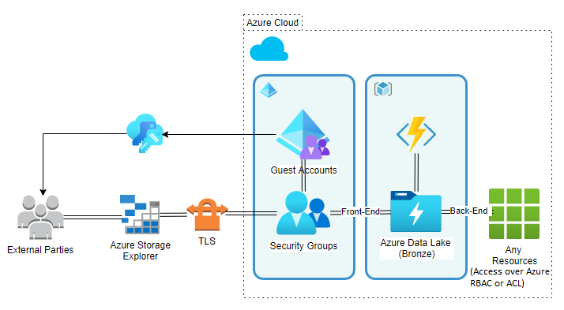

## Logical Interface Definition

The interface of the system implemented using defined directories structure in Data Lake's Hierarchical Name Space (directories) and special naming convention of the blobs (files) stored in it. Interface is defined by combined activities of Terraform script and Function App.

### External Party's interface (Front-End)

External Parties (EP) accessing Azure Data Lake using Azure Storage Explorer that provides access to EP's Home Container. Home Container contains specially defined directories allowing users to interact.

### System's interface (Back-End)

System responsible for data ingest, e.g. Azure Data Factory (ADF), regularly scanning defined folder for the new files to be processed.

### File naming convention

EPs' uploaded files should be renamed following defined naming convention. This naming convention should do the following:

* guarantee unique file naming in the organisation's global namespace
* contain meta-information allowing ADF map new data to the relevant EPs in the internal data stores

## Detailed Interface Definition

### Front-End Interface

After successful EP's authentication, its Home Container contains following directories:

* **Incoming** - drop-off zone for the new data files
* **Report** - Human readable data ingest results report for each data file
* **OK** - 0KB files indicating successful ingest
* **Fail** - 0KB files indication failed ingest

### Back-End Interface

Following containers defining Back-End interface

* **Ingest** - contains data files ready to be processed by data ingestion system e.g. ADF
* **Archive** - contains original EPs files for audit purposes

## Solution's Scope

This SBB focuses on deploying Azure cloud-native infrastructure capability allowing External Parties (EP) securely upload their data files into the organisation's data ingestion gateway. It is built with [Terraform](https://www.terraform.io/intro/index.html) and Azure Function Apps.

### It is expected to do

* Using Terraform capabilities

  * Deploy Azure Data Lake, Application Service Plan, Function Apps, Security Groups Assignments, etc
  * Deploy secure *Service* Containers to be used by data transformation and ingestion tools e.g. Azure Data Factory. This is implementation of the Back-End interface
  * Deploy Security Groups for each EP based on the deployment environment e.g. do not deploy PROD Security Groups in DEV environment
  * Deploy secure *EPs'* Containers that can only be accessed by the members of specifically deployed Security Group (created earlier). This is implementation of the Front-End interface

* Using Azure Functions Apps capabilities

  * Ensure newly uploaded blobs renamed to contain appropriate meta-data in its name following \<EpId>.<8 random aplhanumeric characters>.\<Name or the originally received file> naming convention
  * Ensure newly uploaded blobs moved into appropriate location for further processing by data ingestion systems (Back-End interface) and archiving
  * Ensure *EPs'* Containers include required directories implementing Front-End interface

### It expected NOT to do

* Update content of the files
* Exercise any validation and transformation activities on data files
* Move data files anywhere outside of the deployed Azure Data Lake

## What this solution CAN and CAN'T do (room for improvement)

This solution will not be tested to process large files. This solution should be concidered as a prototype and proof-of-concept. Deciding to use it in production environment is at your own risk.

### It can

* Deploy new Security Group for each EP. (Note *prevent_duplicate_names = true*)
* Deploy new tagged Resource Group
* Deploy new tagged Storage Account with enabled Hierarchical Name Space (Data Lake Store)
* Deploy App Insights to analyze Function App activities
* Handle environment specific Terraform.tfvars files to support various deployment environment e.g. DEV, TEST, PROD
* Move originally uploaded EPs' files into Archive Container with *Archive access tier* enabled (not implemented yet)
* Move originally uploaded EPs' files into Ingest Container and rename them following appropriate naming convention defined by an interface (see above)

### It can't

* Use existing Security Groups. As a workaround, use *terraform import* to converge states or change *resource* blocks to *data* blocks for Security Groups deployment
* Create new B2B Guest Users and add them to the Security Groups. This option is currently [unavailable](https://github.com/hashicorp/terraform-provider-azuread/issues/41) in Terraform
* Purging old files after expiration of the retention period

## Debatable decisions

### IaC and CaC

This SBB logically separates Infrastructure Plane from Configuration Plane. The idea is to get all nessessary Infrastructure components to be deployed and maintained in Infrastructure Plane and Configuration Components to be deployed and maintained in Configuration Plane. Commands from Configuration Plane to Infrastructure Plane published via Queue.

This concept brings such benefits as:

* Independed Plane deployment improves robustness of the solution
* Smaller and easier to test release scopes
* Back-End Interface (Infrastructure Plane) is separated from the Front-End Interface allowing back-end systems to continue their workloads in case of issue in the Configuration Plane

**Infrastructure Plane** suppose to ensure that all nesessary resources are available and frequent change to these resources is not expected.

**Configuration Plane** suppose to easier adapt to the standard change. The standard change is adding and removing new EP profiles in configuration file and Function App, then running terraform apply to deploy/remove Containers, Security Groups and Function Apps. It is designed to be smaller resposibility scope and easier to maintain.

### Data Lake Gen 2 vs Blob Storage

Pros and Cons are analyzed in the scope of this solution only. For overall comparison check-out [Introduction to Azure Data Lake Storage Gen2](https://docs.microsoft.com/en-us/azure/storage/blobs/data-lake-storage-introduction) and [Introduction to Blob Storage](https://docs.microsoft.com/en-us/azure/storage/blobs/storage-blobs-introduction).

#### Azure Data Lake Gen 2 Pros and Cons

Pros | Cons
-----| -----
By design, it's a set of capabilities dedicated to data analytics | .
Various file formats suitable for ADF and HDInsights | .
Hierarchical namespace support | .
A superset of POSIX permissions support | .
Front-End interface is suitable for the automated integration | .

#### Azure Blog Storage Pros and Cons

Pros | Cons
-----| -----
. | By design, it's a object storage solution
. | Virtual directories

In case if basic user experience capabilities are enough for the EPs interation, then Hierarchical Namespace capability might be disable and Blog Storage can be used instead of Data Lake Gen 2 Storage.

### Hot vs Cool access tiers

#### All catalogs except Archive

Main expected capability of this SBB is to provide a secure gateway for EPs' data files transmission that doesn't require various copies of original files to be stored in it for a long period of time. In addition, access to this files is frequent and with high availability requirement for the data to be ingested ASAP. Based on this conclusion, all containers except Archive should be running on *Hot* access tier.

#### Archive catalog

To support audit requirements, all originally submitted files should be archived for potential analysis/investigation in the future. The volume of this data files is large, but access is rare and doesn't need to be immediate, therefore default access tier for the Archive catalog is *Archive*

### Archive & Log Catalogs

To reduce potential security vulnerability surface, Archive and Log catalogs could be deployed in a publically inaccessible data store.

### In-process vs Out-of-process (Isolated) Function App

This solution uses In-process Function App Implementation which imposes some fine-tune disadvantages. It is possible to implement it in Isolated process but potentially requires more coding as some features like Imperative Binding aren't available in Isolated mode. To get to know pros/cons and limitations of both modes read [Guide for running functions on .NET 5.0 in Azure](https://docs.microsoft.com/en-us/azure/azure-functions/dotnet-isolated-process-guide#differences-with-net-class-library-functions)

## Workspace

At the moment, the workspace is running on a local machine in Visual Studio Code (VSC). Terraform commands are executed from VSC Terminal. It is enabled to run [Terraform using Azure PowerShell](https://docs.microsoft.com/en-us/azure/developer/terraform/get-started-powershell) capability. All code is tracked in Git and ready for DevSecOps

When running powershell scripts, regardless of workspace (local machine, CI/CD pipeline), PowerShell execution policies issue might occure. Solution might be found in [About PowerShell Execution Policies](https://docs.microsoft.com/en-us/powershell/module/microsoft.powershell.core/about/about_execution_policies?view=powershell-7.1) article.

## Prerequisites

* [Visual Studio Code](https://code.visualstudio.com/) or another Development Environment
* Prepare your workspace environment by completing [Quickstart: Configure Terraform using Azure PowerShell](https://docs.microsoft.com/en-us/azure/developer/terraform/get-started-powershell) tutorial including terraform installation steps

## Part 2. Implementation

### Infrastructure Plane

Infrastructure Plane takes care of the resources nesessary for the solution to run. It is expected that changes in this plane aren't happening frequently. If change has happend, it will impact entire solution and Accounts of all EPs, therefore if it hasn't been thoroughly tested and introduced some issues in the production environment - access to EPs' accounts, Front and Back-End interfaces might be fully or partially broken.

The logical scope of this plane is overall solution's security, infrastructure, basic functionality and Back-End interface.

It's recommended to setup separate CI/CD pipeline for Infrastructure Plane.

#### Resources managed under Infrastructure Plane (using Terraform capabilities)

* Resourse Group
* Storage Account (Delta Lake Gen 2)
* Terraform Service Principal role assignment (RBAC) to Storage Account for containers management. Note, Terraform Service Principle resource is not included in the Infrastructure Plane (Terraform). This is left for the next round of Improvements of this solution
* Archive, Ingest and Service containers underpinning interfaces and basic solution's capabilities
* Applicaion Service Plan to run, and Application Insights to monitor solution's Function Apps
* Function App resources and role assignments (RBAC) to get access to the Storage Account for _Infrastructure Plane_
* Function App resources and role assignments (RBAC) to get access to the Storage Account for the _Configuration Plane_. Not actual Function Apps, only resources nesessary to run Function Apps
* Publish, compression and deployment of the **packaged** (zip) Function App using "_local-exec_" provisioner "_null_resource_" Terraform capability

#### Functionality managed under Infrasturcture Plane (using Function App capabilities)

* Delete the Blobs from the EPs Incoming directory once it's been copied in the Ingress container
* Create necessary directories (Incoming, Ok, Fail, Report) in the new EPs container

Note that new EP's Container get created in _Configuration Plane_. Once Container has been created, Configuration Plane produces special Command Message and adds it into a Queue. Later this message will be consumed by a Function App in the Infrastructure Plane which will complete initialisation of the newly created Container. Delete Command Messages are also produced in Configuration Plane, and completed by Infrastructure Plane's Funcion Apps.

### Resource Group

Group and Resources
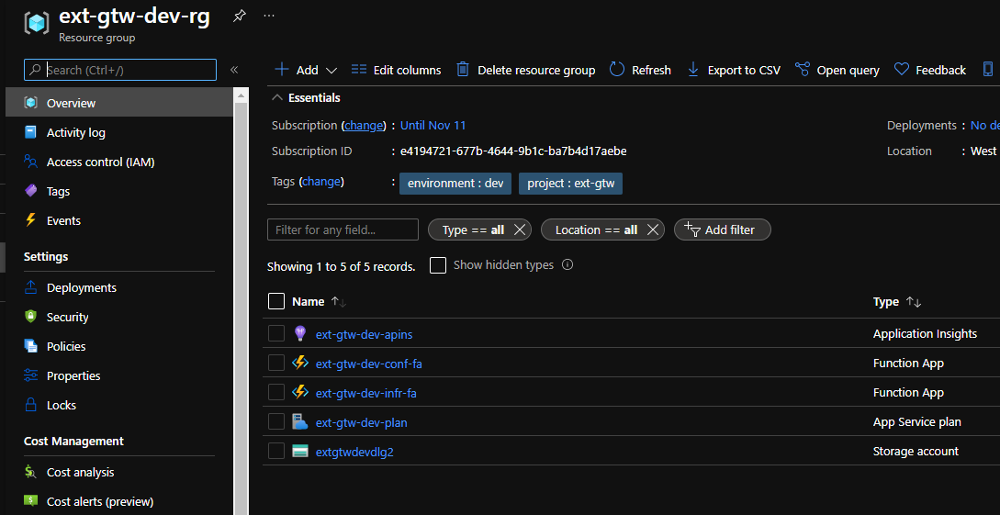

* **ext-gtw-dev-apins** - Application Insights Resource allows to monitor and troubleshoot Function Apps
* **ext-gtw-dev-conf-fa** - Function App Resource where _Configuration Plane_ Function Apps get deployed
* **ext-gtw-dev-infr-fa** - Function App Resource where _Infrastructure Plane_ Function Apps get deployed
* **ext-gtw-dev-plan** - Application Service Plan for both Function Apps
* **extgtwdevdlg2** - Data Lake Gen 2 Storage Account to securely store EPs data files.

### Storage Account

Storage Account and Containers

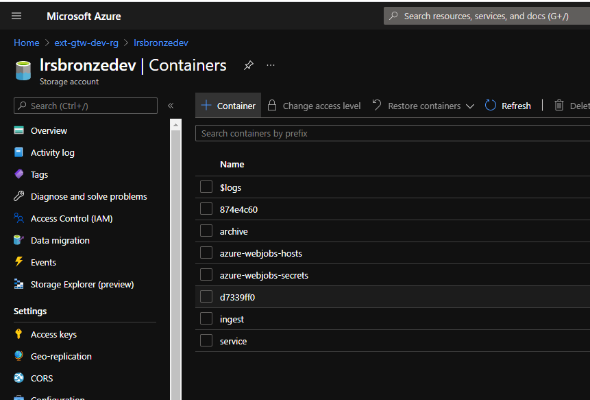

* **Archive** private Container stores EPs original files (blobs). Before blob can be submitted for ingestion (moved into Ingest Container), its original copy will be saved in the Archive Container for Audit capability
* **Ingest** private Container store prepared blobs that are ready to be ingested
* **Sevice** private Container store service blobs nesessary for solution to operate
* **$logs, azure-webjobs-hosts, azure-webjobs-secrets** private Containers used by Azure Function Apps platform
* **874e4c60, d7339ff0** private Containers for Test EPs to be used in other than PROD environments

#### Archive Container

Archive Container stores EPs' files (blobs) with exact content and slightly modified blob name to guarantee uniqueness in the Organisation's global namespace.

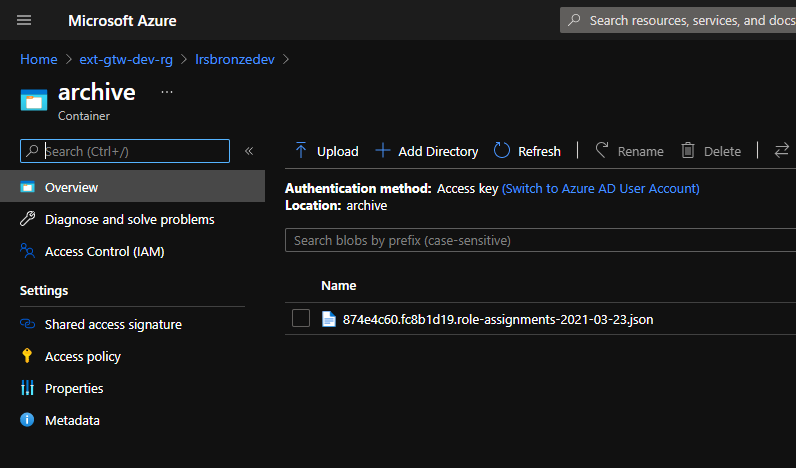

#### Ingest Container

Ingest Container implements Back-End interfaces and plays the role of a gateway for the Oranisation's Internal Systems (e.g. Azure Data Factory) to access EPs data from a single location. The content of the files is unmodified, that is - it's exactly as it has been received from the EPs. The name of the files has been modified following solution's naming convention mentioned in the earlier parts.

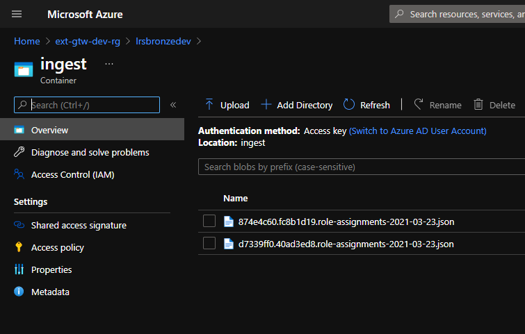

#### Service Container

Service Container stores utility meta-files to support basic solution's functionality. Now it used to trigger EPs Container initialisation Function App. The details of this Function App will be covered in the description of the Configuraion Plane.

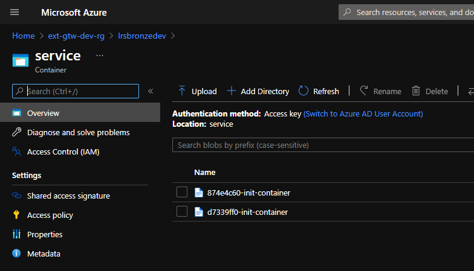

#### Infrastructure Function App

Infrastructure Function App contains following functions:

* **Archive** - polling _archive_ Container. It changes blobs access tier to _Archive_
* **Infrastructure** - polling _infrastructure_ Queue
* **Service** - polling _service_ Container

Infrastructure Plane Function App's implementation details can be found in the Source Code located at "./Infrastructure/func/"

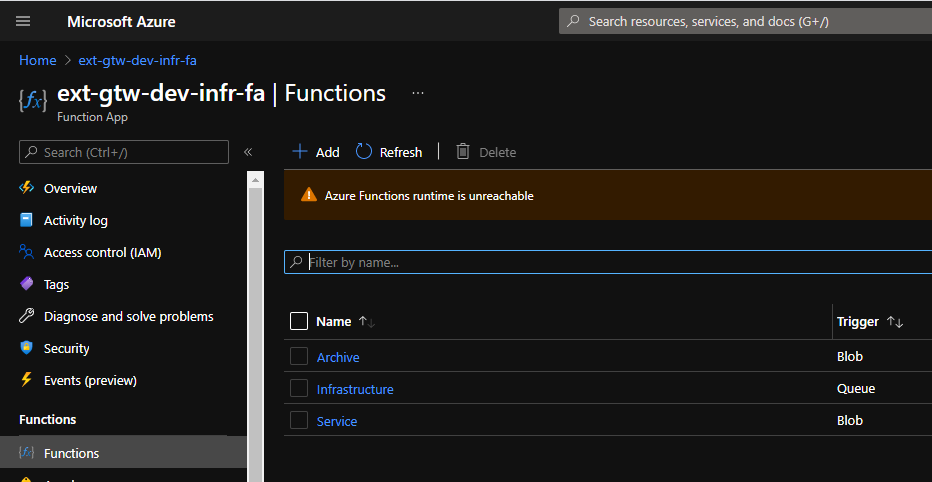

### Configuration Plane

Configuration Plane takes care of the resources with primary scope on the Front-End interface. The changes in this plane suppose to happen more often, therefore it is recommended to setup separate CI/CD pipeline for it. If change has introduced an issue it can be rolledback separately, not affecting the Infrastructure Plane.

The logical scope of this plane is the deployment of secure EP Containers and functionality to initialize and process content of these Containers.

This Plane can't be deployed on its own and depends on the resources deployed by the Infrastructure Plane.

#### Resources managed under Configuration Plane (using Terraform capabilities)

* Azure AD Group for each EP
* Private Storage Account Container for each EP
* EP's B2B Guest Account assignment to the Security Group
* Container initialization meta-blobs for each EP
* Publish, compression and deployment of the packaged (zip) Function App using "local-exec" provisioner "null_resource" Terraform capability

#### Functionality managed under Configuration Plane (using Function App capabilities)

* Rename EP files following special naming convention mentioned earlier in this document
* Copy the Blobs from the EPs Incoming directory to the Archive and Ingress Containers
* Create necessary directories (Incoming, Ok, Fail, Report) in the new EPs container

#### Azure AD Group for each External Party (EP)

This solution deploys separate Security Group for each External party. This group then get "Storage Blob Data Contributor" role assignment to the Container specifically create for this EP.

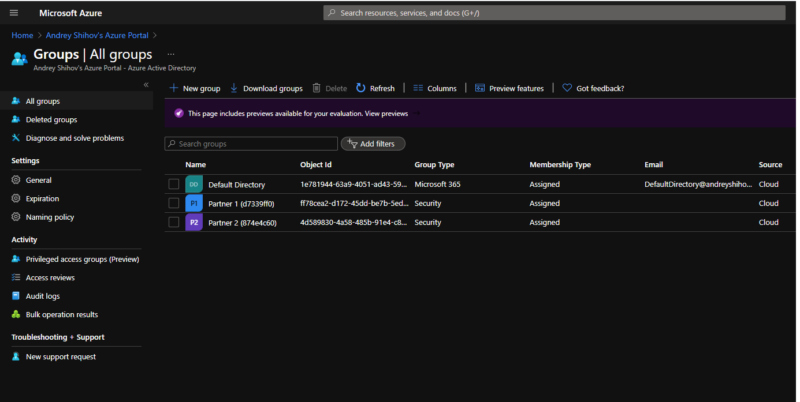

B2B (Guest) Users accounts creation and assignment to the Security Group is out of scope of this prototype solution and should be done manually. This can be potentially resolved in the future improvement rounds.

Assignment example of an External account to the Security Group.

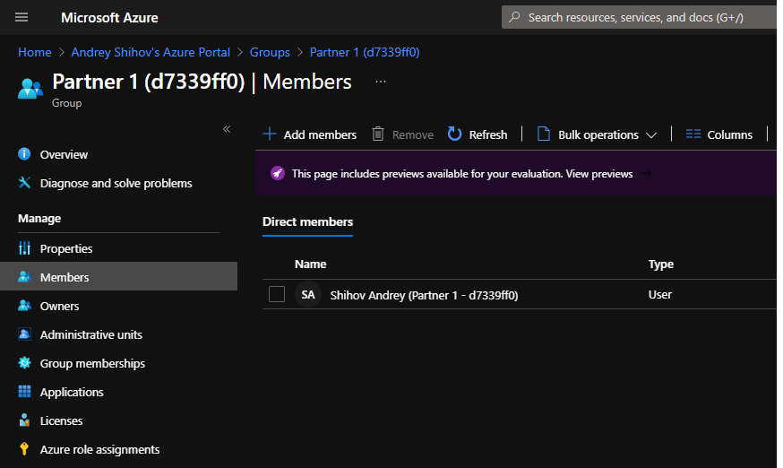

#### Private Storage Account Container for each EP

Each External Party will have its own, secure Container where they can drop-in their data files. This Container has a number of Directories that help an External Party, manually or automatically, interact with this Gateway solution.

For the detail about each directory read Detailed Front-End Interface Definition above in this document.

External Party's Container view in the Azure Portal

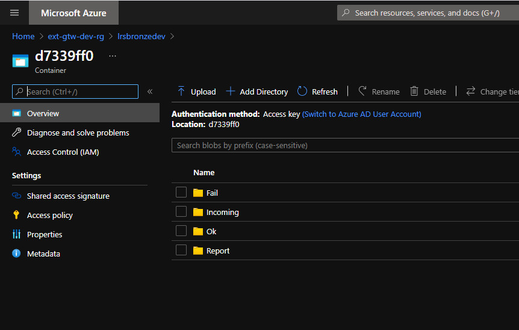

External Party's attached Container view in the Azure Storage Explorer

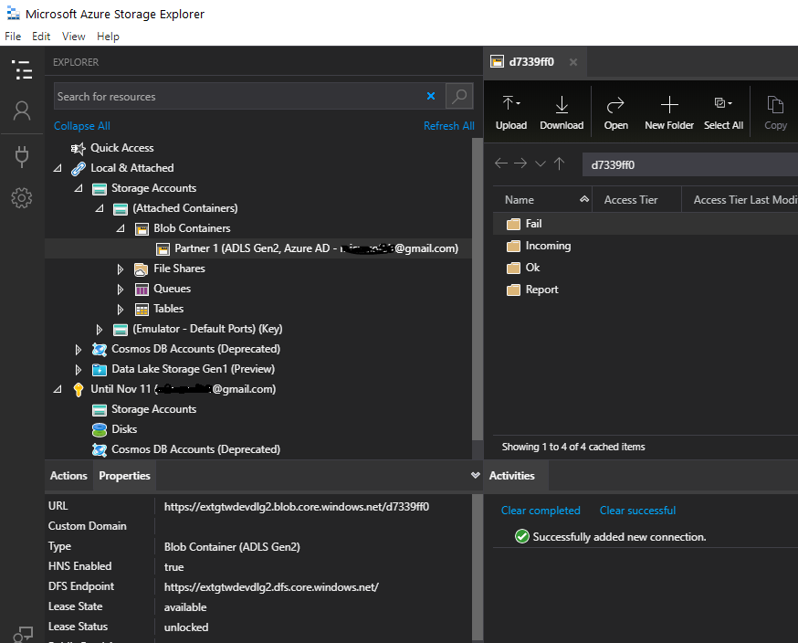

External Party's attachment steps to the secure Container.

Step 1. Select _ADLS Gen2 container or directory_ option.

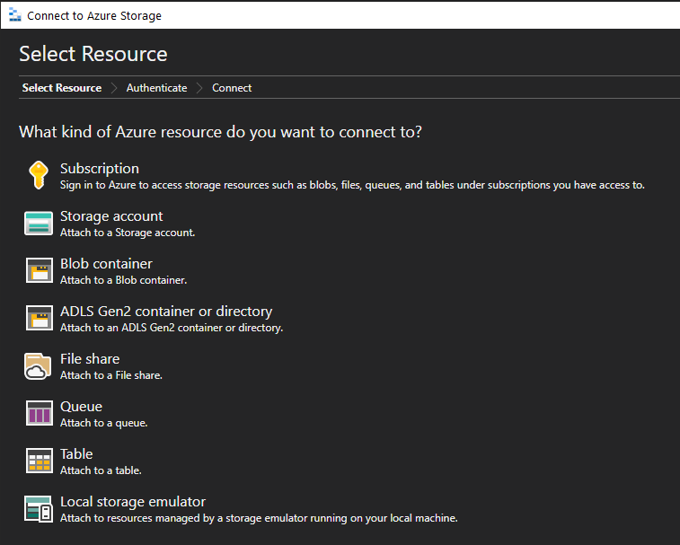

Step 2.

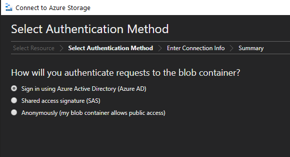

Step 3.

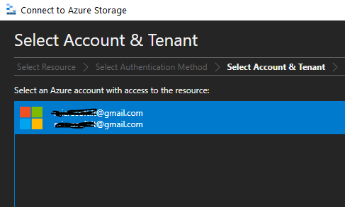

Step 4.

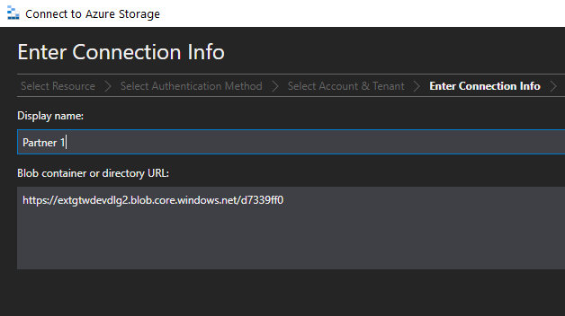

#### EP's B2B Guest Account assignment to the Security Group

To establish secure connection with a Container, each External Party's B2B Guest account should be assigned to a dedicated Security Group.

#### Container initialization meta-blobs for each EP

To implement Front-End interface, Each EP's Container should have apropriate directories defined in detailed Front-End interface. Configuration Plane's Terraform script creates special meta-blobs in _Service_ Container. These meta-blobs will be picked up by a Function App which then will create these directories in the newly created External Party's Container.

The naming convetion for this meta-blobs is \<EpId>-init-container.

#### Configuration Function App

Configuration Function App functions polling each EPs _Incoming_ directory for the appearance of the new files (blobs). There's one function for one EP. The functionality of the function is exactly the same for each External Party.

The source code of these function located in _./Configuration/func_ directory

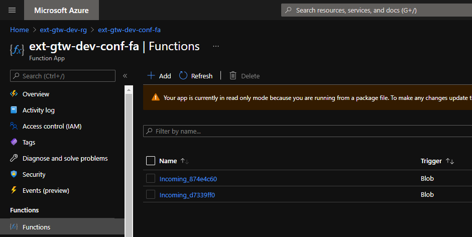

## Known issues and further improvements

### null_resource, provisioner, local-exec

* First time application of the Terraform scripts might lead to a Function App deployment hanging up in a "Still creating..." state for a long time. This is caused by _local-exec provisioner_ PowerShell script that deploys Function App from packaged (zip) file.
Workaround: run _terraform apply_ command again.

Terraform Deployment Terminal View

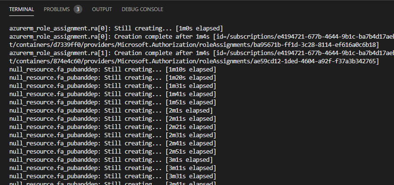

Function App deployment Portal View

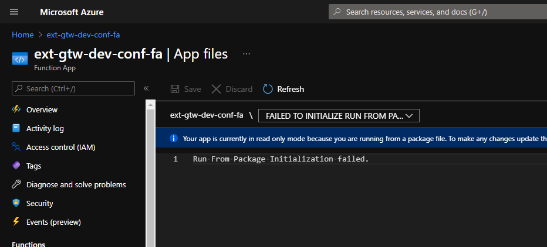

### B2B (Guest) User accounts and Security Group assignments

B2B (Guest) Users accounts creation and assignment to the Security Group potentially can be implemented in the future improvement rounds.

### Terraform Service Principal Account

Terraform Service Principle Account has been created outside of this deployment

### References

[Use PowerShell to manage directories and files in Azure Data Lake Storage Gen2](https://docs.microsoft.com/en-us/azure/storage/blobs/data-lake-storage-directory-file-acl-powershell)

[Azure Blob storage trigger for Azure Functions](https://docs.microsoft.com/en-us/azure/azure-functions/functions-bindings-storage-blob-trigger?tabs=csharp#poison-blobs)

[Using Managed Identity between Azure Functions and Azure Storage](https://docs.microsoft.com/en-us/samples/azure-samples/functions-storage-managed-identity/using-managed-identity-between-azure-functions-and-azure-storage/)

[Authorize access to blob and queue data with managed identities for Azure resources](https://docs.microsoft.com/en-us/azure/storage/common/storage-auth-aad-msi)

[How to rename a blob file in Azure Blob Storage (using a code snippet)](https://github.com/Azure-Samples/storage-blobs-dotnet-rename-blob)
